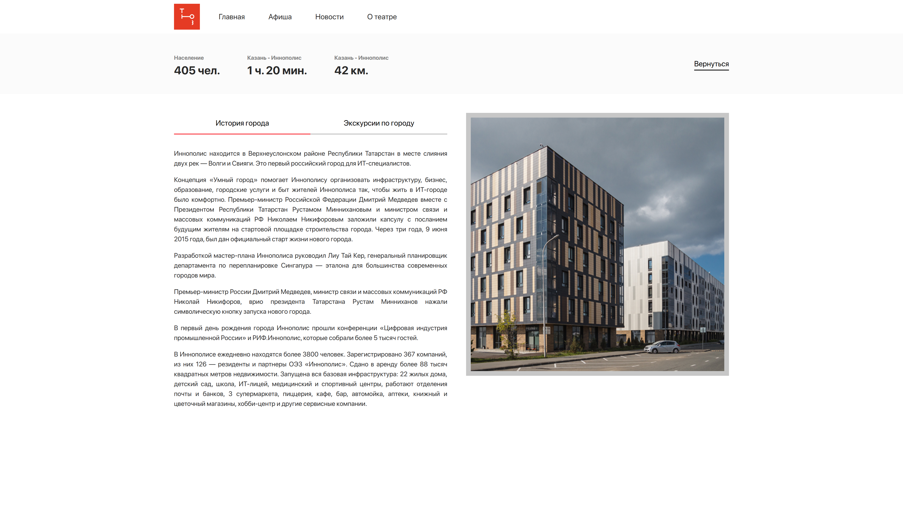
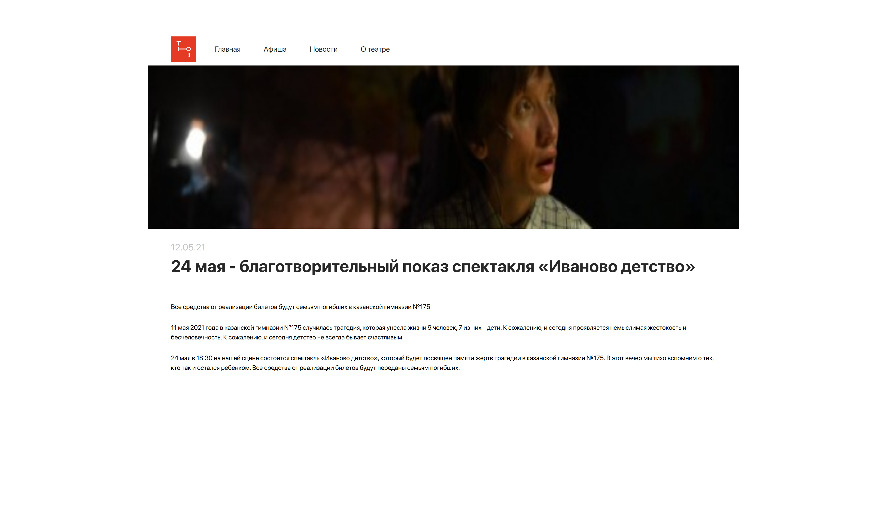
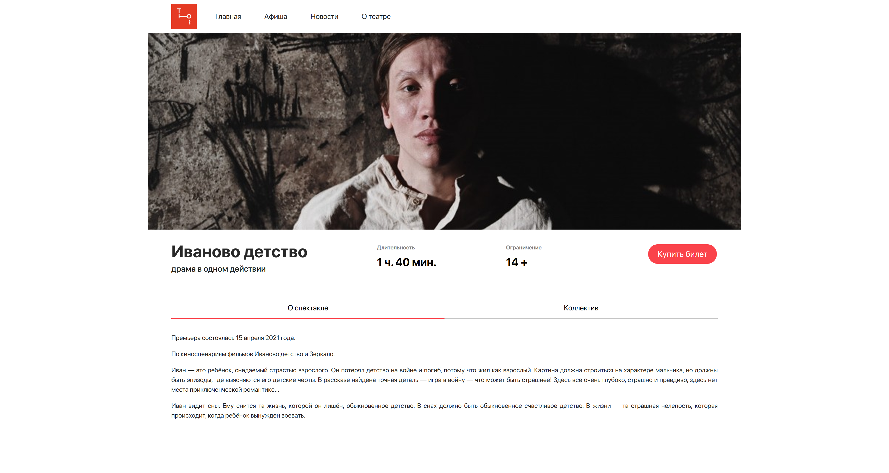
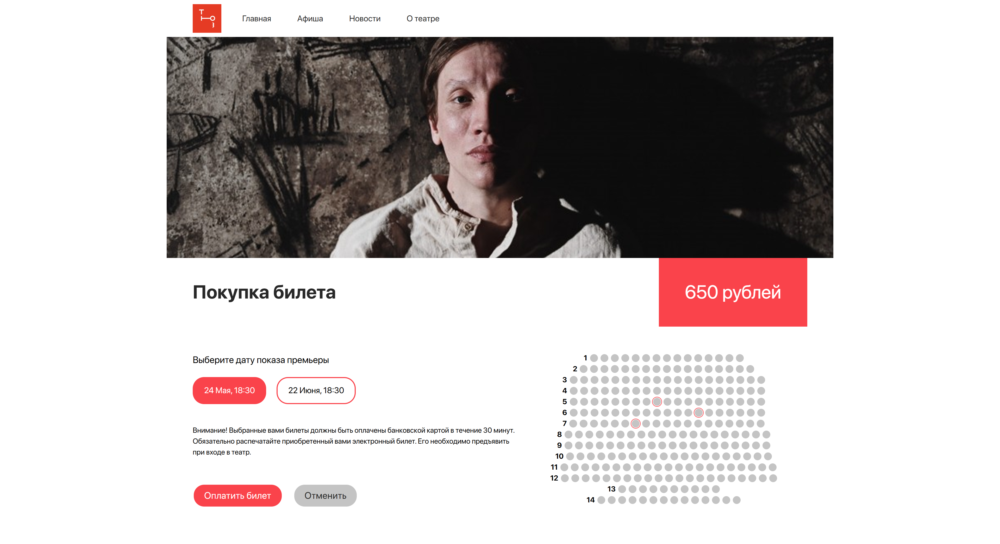
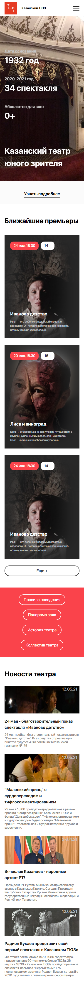
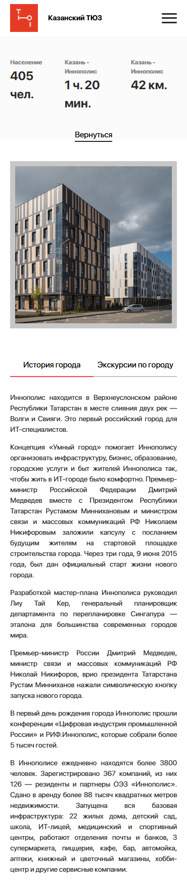
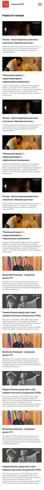
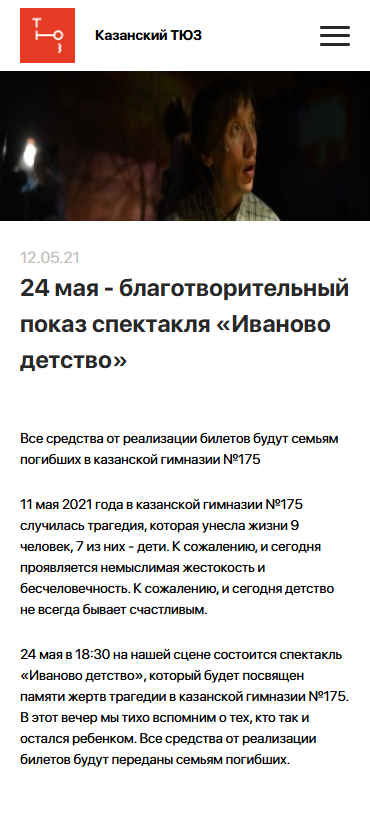
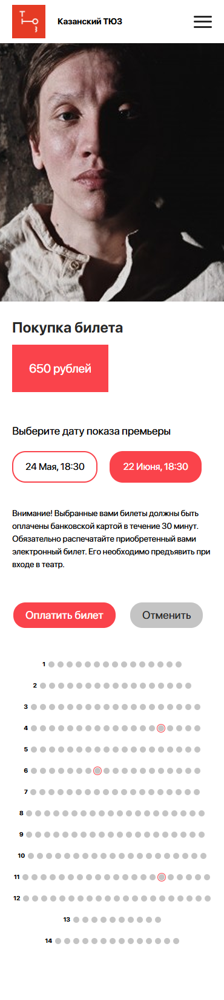

# Theatre

## 📜 Лицензия
Этот проект распространяется под лицензией **MIT**.  
Подробнее см. [LICENSE](LICENSE).

**Описание проекта**: Казанский театр юного зрителя — это современный культурный центр, предлагающий зрителям актуальные постановки и удобный сервис онлайн-бронирования. Данный проект представляет собой веб-приложение для просмотра афиш, покупки билетов и знакомства с новостями театра, а также при покупке появляется всплывающее окно с информацией о покупке. Данный проект был реализован в виде заказа на создание сайта. Мне был предоставлен дизайн сайта мне предстояло реализовать его в виде React(frontend) и Nest(api).
[](https://opensource.org/licenses/MIT)
[](https://reactjs.org)  
[](https://nestjs.com)

### Функционал

- Просмотр афиш.
- Онлайн покупка билетов.
- Информация о театре.
- Список новостей.

### Технологии

- **Frontend**: React 18, TypeScript, React Router 6, React Query, Axios, Vite, SCSS, SVGR, FSD-архитектуры(Feature-Sliced Design).
  [](https://reactjs.org/)  
  [](https://www.typescriptlang.org/)  
  [](https://reactrouter.com/)  
  [](https://tanstack.com/query/latest/)  
  [](https://axios-http.com/)  
  [](https://vitejs.dev/)  
  [](https://sass-lang.com/)  
  [](https://react-svgr.com/)  
  [](https://feature-sliced.design/)
- **Backend**: NestJS, PostgresSQL, TypeORM.
   [](https://nestjs.com/)  
  [](https://www.postgresql.org/)  
  [](https://typeorm.io/)  
- **Дизайн**: Figma.
  [](https://figma.com/)

### Установка

1. Клонирование репозитория:

   ```bash
   git clone https://github.com/BlackDarkes/Theatre.git

   ```

2. Запустите проект:
   
    Node.js >= 18.x
    npm >= 9.x
   ```bash
   cd api && npm install && npm start
   cd frontend && npm install && npm run dev
   ```

### Примеры кода

1. React

   ```TypeScript
    import { SchemeElement } from "../ui/SchemeElement/SchemeElement";

    interface IGenerateSchemeProps {
      scheme: number[];
      classScheme: Record<string, string>;
    }
      
    export const GenerateScheme = ({ scheme, classScheme }: IGenerateSchemeProps) => {
      return (
        <div>
          {scheme.map((count, rowIndex) => (
            <div key={`row-${rowIndex}`} className={classScheme.paymentSchemeScheme}>
              <h3 className={classScheme.paymentSchemeNumber}>{++rowIndex}</h3>
              {Array.from({ length: count }).map((_, seatIndex) => (
                <SchemeElement id={`${rowIndex}-${seatIndex}`} key={`${rowIndex}-${seatIndex}`} />
              ))}
            </div>
          ))}
        </div>
      );
    }
   ```

2. NestJS
   ```TypeScript
   import { Controller, Get, Param } from '@nestjs/common';
   import { EventsService } from './events.service';

   @Controller('events')
   export class EventsController {
     constructor(private readonly eventsService: EventsService) {}

     @Get(":title")
     getEvents(@Param("title") title: string) {
       return this.eventsService.getEvents(title);
     }
   }
   ```

### Структура проекта:
    project/  
    ├── frontend/       # React-приложение  
    ├── backend/        # NestJS-сервер  
    └── README.md  

## Изображения проекта:
1. **Desktop изображения:**
  
  *Рис. 1: Главная страница сайта в десктопной версии.* 

  
  *Рис. 2: Страница о театре сайта в десктопной версии.* 

  
  *Рис. 3: Страница со всеми новостями сайта в десктопной версии.*

  
  *Рис. 4: Страница конкретной новости сайта в десктопной версии.*

  
  *Рис. 5: Страница с событием сайта в десктопной версии.*

  
  *Рис. 6: Страница оплаты мероприятия сайта в дестопной версии. (В данном примере выбраны дата и места для примера!!!!!!!!!!)*

2. **Mobile изображения:**
   
   

   *Рис. 7: Главная страница сайта в мобильной версии.*

   

   *Рис. 8: Страница о театре сайта в мобильной версии.*

   

   *Рис. 9: Страница со всеми новостями сайта в мобильной версии.*

   

   *Рис. 10: Страница конкретной новости сайта в мобильной версии.*

   

   *Рис. 11: Страница с событием сайта в мобильной версии.*

   

   *Рис. 12: Страница оплаты мероприятия сайта в мобильной версии. (В данном примере выбраны дата и места для примера!!!!!!!!!!)*